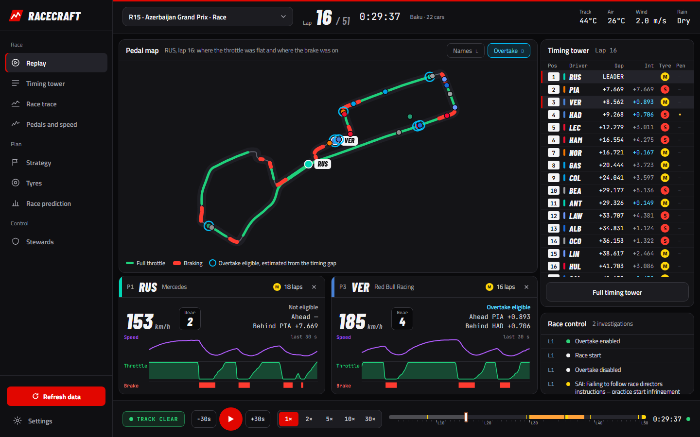
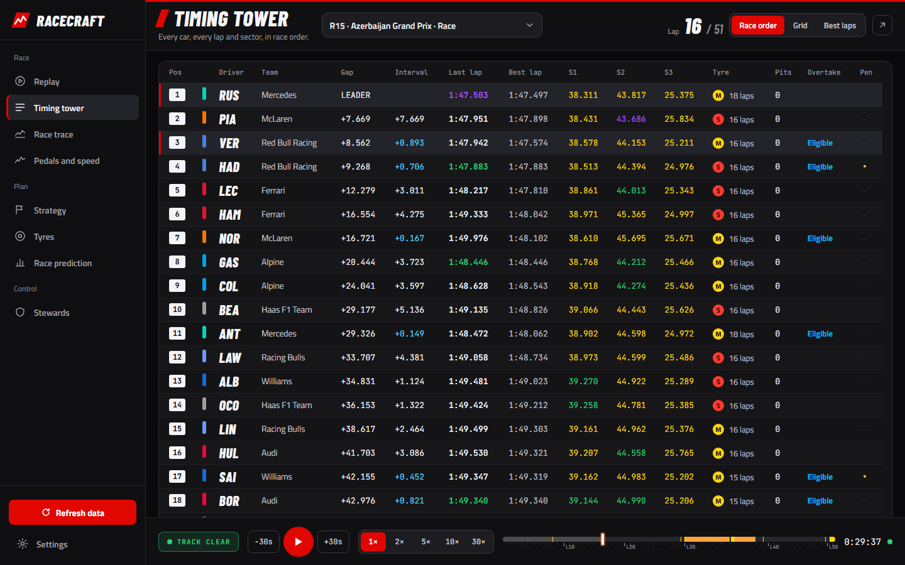
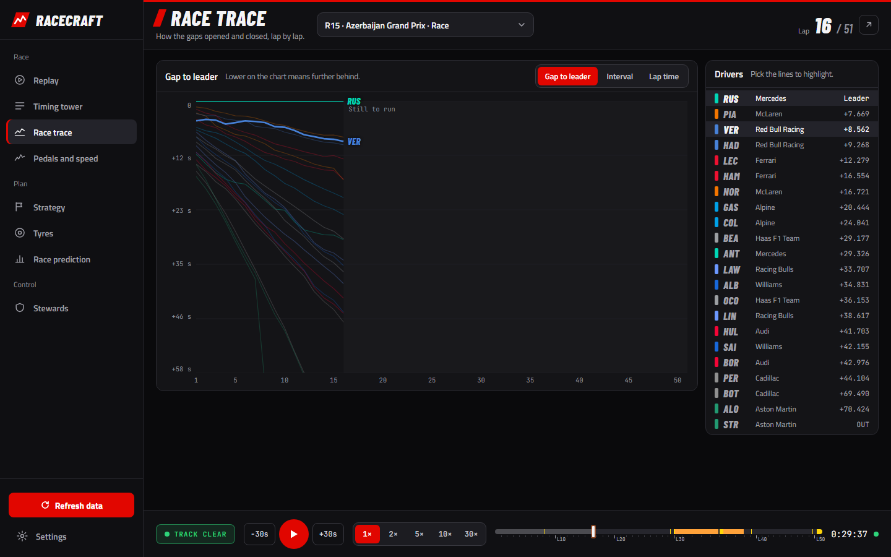
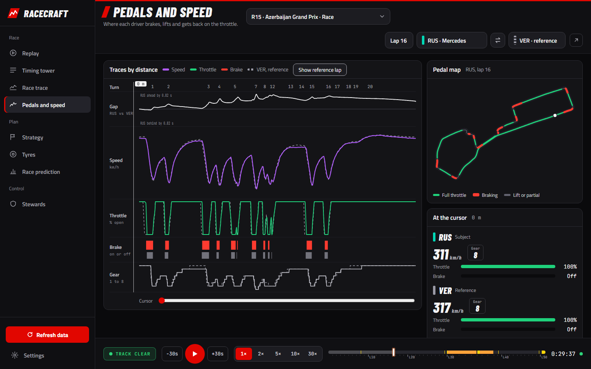
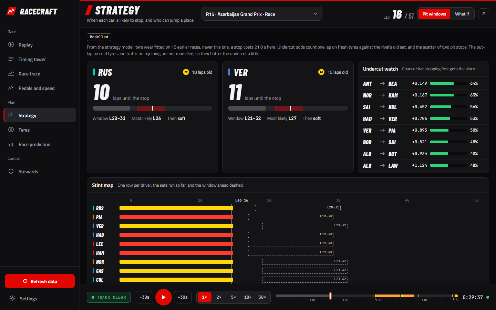
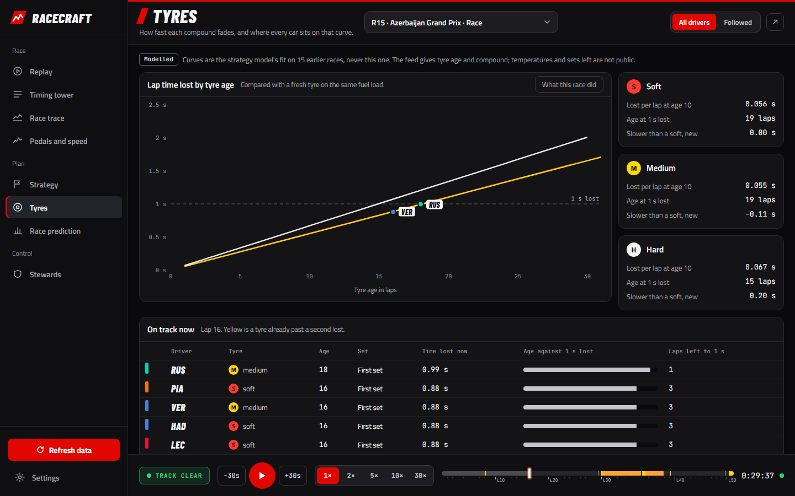
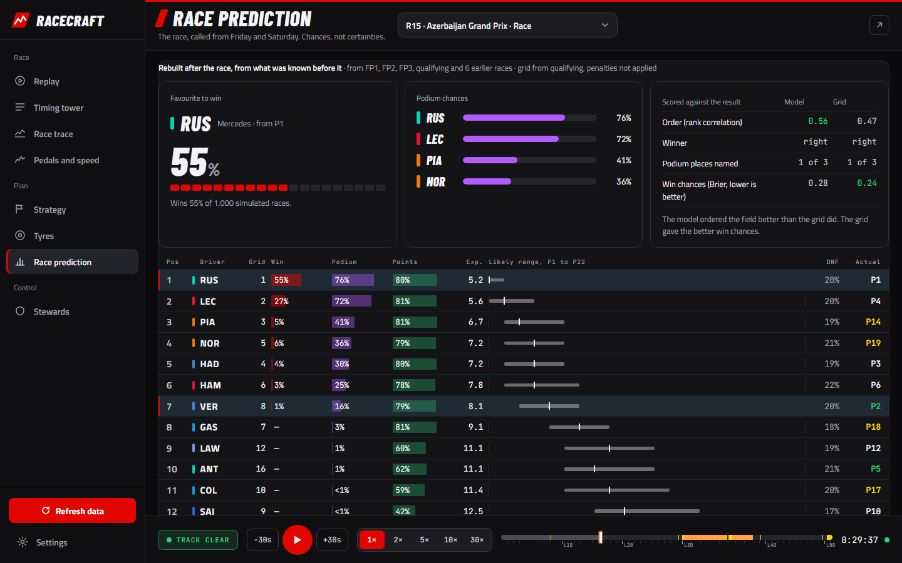
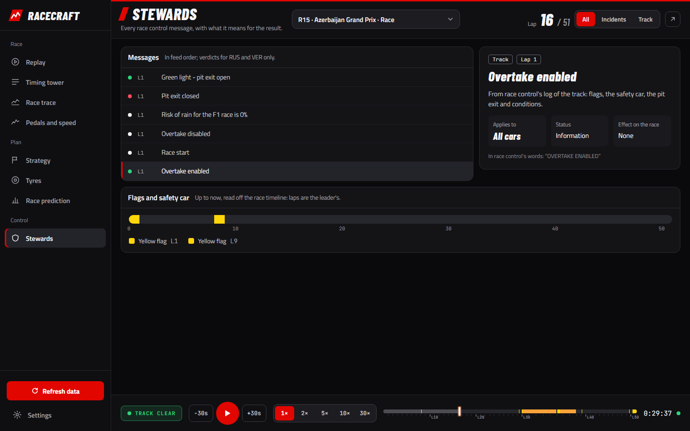
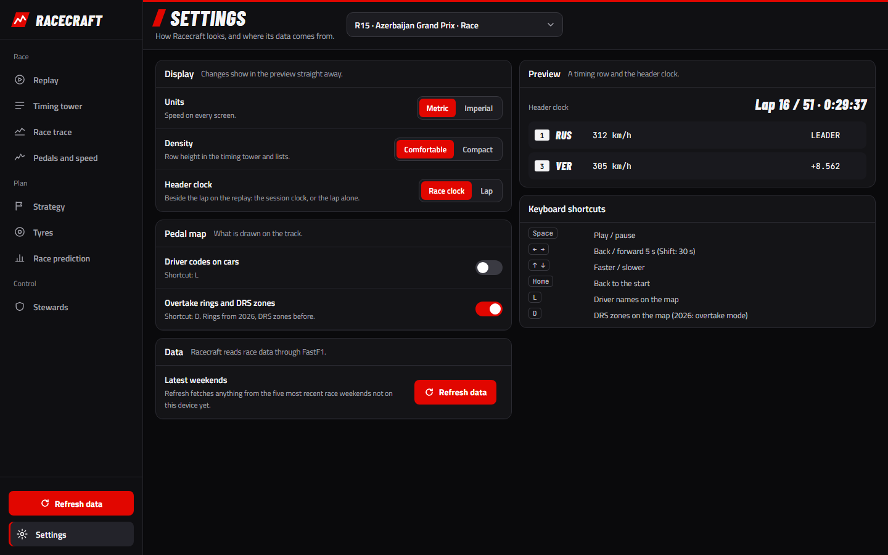

# Racecraft

**An F1 race replay and strategy workbench, built on public timing data.**

Racecraft replays any Formula 1 session since 2023 on a live track map, with
every car's telemetry, the timing tower and race control. It also models what
the public feed does not show: tyre wear, the cost of a pit stop, when each car
is best off stopping, whether an undercut will work, and how the race is likely
to finish, called from Friday and Saturday's running.

It runs as a Windows desktop app, or as a local web app in any browser.



---

## Contents

- [What it does](#what-it-does)
- [The screens](#the-screens)
- [How it works](#how-it-works)
- [The models, and how good they are](#the-models-and-how-good-they-are)
- [Setup guide](#setup-guide)
- [Using the app](#using-the-app)
- [Command line](#command-line)
- [Live timing](#live-timing)
- [Building the Windows installer](#building-the-windows-installer)
- [Development](#development)
- [Project layout](#project-layout)
- [Configuration](#configuration)
- [Security](#security)
- [Limits, and what the data cannot tell you](#limits-and-what-the-data-cannot-tell-you)
- [Data, licences and credits](#data-licences-and-credits)

---

## What it does

- **Replays any session** from 2023 to now (practice, qualifying, sprint and
  race; 430 sessions, 86 races) with the cars moving on a map drawn from their
  own GPS positions, at 1x to 30x.
- **Shows what each car is doing**: speed, gear, throttle, brake, DRS (or, from
  2026, overtake mode), and the last 30 seconds of it as a trace.
- **Compares two drivers' laps metre for metre**: where each brakes, how hard
  they carry speed, where the time is gained.
- **Works out strategy**: what wear and the pit lane cost at each circuit, the
  cheapest plans with and without safety cars, when each car should stop, and
  the odds that stopping first wins a place.
- **Predicts the race** from practice, qualifying, the sprint and recent form,
  as each driver's chance to win, reach the podium and score, checked against
  every race since 2023.
- **Explains race control**: every steward's verdict and track message in plain
  words, with what it means for the result.
- **Follows a session live** from F1's own timing feed (no subscription needed).
- **Keeps itself current**: the desktop app fetches the latest race weekends
  while it is open.

Every model is held out: for a race that has happened, it is fitted only on
races before it, so what you see is what it would have said at the time.

---

## The screens

The app has a navigation rail on the left and a playback bar along the bottom.
Every screen except the replay and settings can pop out into a window of its
own (the ↗ button), which follows the main window's clock: put the timing tower
on a second monitor.

| | |
|---|---|
| **Replay**: the pedal map (the circuit coloured by a followed car's last lap: green where the throttle was flat, red where it braked), cards for up to two followed drivers with their last 30 s of speed, throttle and brake, the timing tower and race control. |  |
| **Timing tower**: every car's gap, interval, last and best lap, the three sectors in timing colours (purple fastest, green personal best, yellow slower), tyre and age, stops, overtake and penalties. Sort by race order, grid or best lap. |  |
| **Race trace**: gap to the leader, interval or lap time, lap by lap, drawn only up to the lap on the clock so nothing is spoiled. Safety-car laps are shaded; click to jump to a lap. |  |
| **Pedals and speed**: one driver's lap against another's by distance: the time between them, speed, throttle, brake and gear, the corners marked, a cursor through every trace and the pedal map, and each brake zone side by side. |  |
| **Strategy**: each car's pit window and most likely stop lap, the undercut watch (chance that stopping first gets the place) and a stint map. *What if* holds the cheapest plans, with safety cars and raced in places. |  |
| **Tyres**: the wear curve per compound with every car placed on it, the race's own tyres as optional hindsight, and every car's sets through the weekend. |  |
| **Race prediction**: the favourite, the podium chances, the full predicted order with each driver's likely range, and after the race the result beside it, scored against the grid. |  |
| **Stewards**: every race control message explained (what it is, its status, its effect on the race) and the flags and safety cars across the race. |  |
| **Settings**: units, row density, the header clock, the map's names and overtake rings, and refreshing the data. |  |

---

## How it works

```
 F1 timing feed ──► FastF1 ──► ingest ──► Parquet lake ──► DuckDB ──► models ──► FastAPI ──► React app
 (historic + live)            (checks)   data/lake/           (queries)   (Python)   (JSON API)   in a desktop window
                                          one file per                                            or a browser
                                          table per session
```

- **Ingest** (`racecraft-ingest`) pulls each session through
  [FastF1](https://github.com/theOehrly/Fast-F1): laps, results, car telemetry
  (speed, throttle, brake, gear, DRS, about four samples a second), GPS
  positions, weather, race control and track status. It checks the data before
  writing and stores it as Parquet, one file per table per session, in
  `data/lake/` (about 1.5 GB for 2023 to 2026).
- **DuckDB** reads the lake in place. The small tables are held in memory; the
  telemetry stays on disk and is read one session at a time.
- **The models** (Python, numpy and pandas) fit tyre wear, pace and pit loss
  from earlier races, simulate races car by car, and predict results. See
  below.
- **The API** (FastAPI) serves a session at any instant: the running order, every
  car's position and telemetry, race control, and the models' answers.
- **The interface** (React and TypeScript, built with Vite) draws it. The map and
  the telemetry are buffered ahead of the clock and interpolated between
  samples, so playback is smooth at every speed.
- **The desktop app** wraps the same thing in its own window (pywebview on
  Windows' WebView2), with no terminal and no port to remember.

---

## The models, and how good they are

Each is described in full, with the measurements behind it, in
[docs/TECHNICAL.md](docs/TECHNICAL.md).

- **Tyre wear and pace.** Fitted per season on clean race laps, with fuel burn
  and track evolution separated from wear. Compounds are compared on the same
  fuel load.
- **The circuit.** Pit lane loss measured from green-flag stops, safety-car
  and VSC rates (shrunk toward the league average for circuits with little
  history), and how often cars actually pass.
- **Strategy.** Every plan costed in seconds (tyres, compounds, stops), then
  re-ranked under random safety cars, then raced against the whole field in a
  car-by-car simulator that knows the wake of the car ahead and how hard
  passing is at this circuit, so it scores plans in **places**, not seconds.
- **Pit windows and the undercut.** For each car at the clock's moment: the
  stop lap that loses least over the rest of the race, every lap within two
  seconds of it, and for close pairs the chance that one lap on fresh tyres
  beats the gap, given the scatter of two pit stops.
- **Race prediction.** Each driver's race pace is estimated from qualifying,
  practice long runs, the sprint, recent form and (early in a season) last
  season's form, each weighted by how well it predicted real races, then the
  race is simulated 1,000 times. Replayed over every race since 2023, each
  predicted only from what was known before it:

  | | Finishing order (rank correlation) | Win chances (Brier, lower is better) |
  |---|---|---|
  | 2023 to 2025, 69 races | **0.69** model, 0.66 grid | **0.54** model, 0.63 grid |
  | 2026 (a new rulebook, never trained on), 16 races | **0.66** model, 0.64 grid | **0.46** model, 0.50 grid |

  It beats "everyone finishes where they started" every season, by a small
  margin; the grid already holds most of what is knowable on Saturday night.
  On naming the winner it ties pole.
- **Overtake mode (2026).** The feed never says when a driver used it, so a car
  is shown as *eligible* when race control has it switched on and the car was
  within a second of the one ahead at the last timing line. An estimate, and
  labelled as one.

---

## Setup guide

### What you need

| | Version | Check with |
|---|---|---|
| Windows 10 or 11 | for the desktop app; the browser mode runs on macOS and Linux too | |
| Python | 3.11 or newer | `python --version` |
| Node.js | 20.19+ or 22.12+ (needed by Vite 7) | `node --version` |
| Git | any | `git --version` |
| Disk | about 3 GB for 2023 to 2026, less for fewer seasons | |
| WebView2 runtime | ships with Windows 11 and with Edge on Windows 10 | |

### 1. Get the code

```powershell
git clone https://github.com/Adityavalaki/racecraft.git
cd racecraft
```

### 2. Install the Python side

```powershell
python -m venv .venv
.venv\Scripts\python -m pip install -e ".[dev,app]"
```

On macOS or Linux, use `.venv/bin/python` and leave out `app` (the desktop
window is Windows-only; everything else works):

```sh
python3 -m venv .venv
.venv/bin/python -m pip install -e ".[dev]"
```

`dev` adds the test tools; `app` adds pywebview for the desktop window.

### 3. Build the interface

```powershell
cd web
npm install
npm run build
cd ..
```

This writes `web/dist/`, which the server and the desktop app serve. Rebuild
after changing anything under `web/src/`.

### 4. Get some race data

The lake starts empty. Either let the app fetch the latest five race weekends
(step 5, it does this by itself), or ingest what you want from a terminal:

```powershell
.venv\Scripts\racecraft-ingest --season 2025 --rounds 4 --sessions FP2 Q R   # one weekend, quickly
.venv\Scripts\racecraft-ingest --season 2025 --prune-cache                   # a whole season
.venv\Scripts\racecraft-ingest --prune-cache                                 # everything, 2026 back to 2023
```

**A full backfill takes hours, and that is expected.** FastF1 allows 500
uncached requests an hour to F1's servers; the command waits for its budget
rather than risk getting you blocked, and resumes where it left off if you run
it again. On Windows, `scripts\backfill.ps1` runs it while keeping the machine
awake. Always pass `--prune-cache`, or FastF1's download cache grows by several
gigabytes.

### 5. Run it

**As a desktop app (Windows):**

```powershell
.venv\Scripts\racecraft --install-shortcuts     # adds Racecraft to the Desktop and Start menu
```

Then double-click **Racecraft**. It opens in its own window, fetches the latest
race weekends ten seconds after launch and every fifteen minutes while open,
and stops completely when you close it. A second launch brings the open window
forward. Logs are in `data/logs/`. Remove the icons with
`racecraft --uninstall-shortcuts`.

**In a browser (any system):**

```powershell
.venv\Scripts\racecraft-serve          # http://127.0.0.1:8000
```

Open <http://127.0.0.1:8000>. Pop-out screens open as browser windows.

### 6. Check it works

```powershell
.venv\Scripts\python -m pytest -m "not network"     # Python tests, offline
cd web; npm test; cd ..                             # interface tests
```

Tests marked `realdata` use your lake and skip themselves when a session they
need is not in it.

### Troubleshooting

| Problem | Fix |
|---|---|
| The session list is empty | No data yet: press **Refresh data** at the foot of the rail, or run `racecraft-ingest` (step 4). |
| `racecraft` is not recognised | Use the full path, `.venv\Scripts\racecraft`, or activate the environment first: `.venv\Scripts\Activate.ps1`. |
| The window is blank | Build the interface (step 3); check `data/logs/app-*.log`. |
| Ingest is "waiting" for a long time | It is respecting FastF1's rate limit. Leave it running. |
| A session shows no track map | Some sessions have no position data in F1's feed; the app says so. |
| Fonts look plain | Rebuild the interface; the fonts are bundled by `npm install`. |
| VS Code uses the wrong Python | Command Palette, *Python: Select Interpreter*, pick `.venv`. |

---

## Using the app

- **Pick a session** from the picker at the top. **Play** with Space or the red
  button; **scrub** on the timeline, which is coloured by yellow flags, safety
  cars, VSC and red flags, with the laps marked.
- **Follow a driver** by clicking them in the timing tower (up to two): they get
  a card under the map and a tag on it, the pedal map shows their last lap, and
  the stewards narrow to them.
- **Pop out** any screen with ↗; it stays in step with the main window.
- **Resize** the timing tower and the driver cards by dragging their edges;
  double-click or *Reset layout* to put them back.

| Key | Does |
|---|---|
| Space | Play or pause |
| ← → | Back or forward 5 s (with Shift, 30 s) |
| ↑ ↓ | Faster or slower |
| Home | Back to the start |
| L | Driver names on the map |
| D | DRS zones on the map (2026: overtake rings) |

---

## Command line

| Command | What it does |
|---|---|
| `racecraft` | The desktop app. `--install-shortcuts`, `--uninstall-shortcuts`. |
| `racecraft-serve` | The API and interface on `http://127.0.0.1:8000` (`--port`, `--reload`). |
| `racecraft-ingest` | Fetch sessions into the lake (`--season`, `--rounds`, `--sessions`, `--prune-cache`, `--watch`). |
| `racecraft-analyse pace` | Tyre degradation and fuel effect, per season. |
| `racecraft-analyse circuits` | Pit loss and safety-car risk at every circuit. |
| `racecraft-analyse circuit Baku` | Everything known about one circuit. |
| `racecraft-analyse strategy Baku` | The cheapest plans, in seconds. |
| `racecraft-analyse race Baku --grid 8` | Plans for one car, raced against the field, in places. |
| `racecraft-analyse predict 2025_04_Q` | The weekend's race, predicted from before it started. |
| `racecraft-analyse predict-backtest` | Every race since 2023 predicted and scored against the grid. |
| `racecraft-live record` / `status` / `read` | Record F1's live timing feed, and read it back. |

Session keys look like `2025_04_R`: season, round, session (`FP1`, `FP2`,
`FP3`, `SQ`, `S`, `Q`, `R`).

---

## Live timing

```powershell
.venv\Scripts\racecraft-live record --name baku-2026     # start before the session, leave running
.venv\Scripts\racecraft-serve                            # then pick LIVE in the session list
```

Racecraft records F1's own timing stream (the one MultiViewer reads) to a file
and reads it into the same views as a historic session. **No F1 TV subscription
is needed** for timing. Live carries the timing side (the tower, the trace,
tyres, strategy); car positions and telemetry are not recorded live, so there
is no track map until the session is ingested afterwards.

---

## Building the Windows installer

```powershell
powershell -ExecutionPolicy Bypass -File packaging\build_app.ps1     # dist\Racecraft\Racecraft.exe, no Python needed
powershell -ExecutionPolicy Bypass -File packaging\build_msix.ps1    # dist\Racecraft.msix, signed
```

The frozen app runs as-is on any Windows 10 or 11 machine; the MSIX installs it
into the Start menu. Signing needs a certificate made once with
`packaging\make_cert.ps1`, and the first install trusts it from an elevated
PowerShell (`packaging\install_msix.ps1`). Installed, the app keeps its data in
`%LOCALAPPDATA%`, separate from a source checkout's `data/`. Full steps:
[packaging/README.md](packaging/README.md).

---

## Development

```powershell
.venv\Scripts\racecraft-serve --reload          # the API, restarting on change, on :8000
cd web; npm run dev                             # the interface with hot reload, on :5173
```

The dev server proxies `/api` to port 8000. Before committing:

```powershell
.venv\Scripts\python -m pytest -m "not network"
cd web; npm test; npm run build; npm audit
```

Conventions: every model figure comes from a command or script that reproduces
it; a model never sees the race it is asked about; anything estimated says so
on screen. More in [docs/TECHNICAL.md](docs/TECHNICAL.md).

---

## Project layout

```
racecraft/
├── src/racecraft/
│   ├── config.py          where data lives (overridable, see Configuration)
│   ├── ingest/            FastF1 to tables, quality checks, the sync of recent weekends
│   ├── store/             the Parquet lake (atomic writes) and DuckDB over it
│   ├── live/              recording and reading F1's live timing feed
│   ├── model/             pace, circuits, strategy, the race simulator, prediction
│   ├── api/               FastAPI: sessions, timing, telemetry, insight, pit windows, prediction
│   └── app/               the desktop app: window, server, single instance, auto-sync, shortcuts
├── web/src/
│   ├── App.tsx            the main window: rail, screens, playback
│   ├── shell/             the rail and screen headers
│   ├── screens/           one component per screen
│   ├── panels/            the map, timing tower, cards, playback bar and other pieces
│   └── styles.css         the design: tokens, layout, every screen
├── tests/                 Python tests (offline; `realdata` ones use your lake)
├── packaging/             PyInstaller spec and MSIX scripts
├── scripts/               validation scripts behind the figures in the docs
├── docs/                  TECHNICAL.md and the screenshots
├── legacy/                the two earlier projects Racecraft grew out of
└── data/                  (not in git) lake/, logs/, predictions/, caches
```

---

## Configuration

All optional, set as environment variables:

| Variable | Default | What it sets |
|---|---|---|
| `RACECRAFT_DATA_DIR` | `data/` in a checkout, `%LOCALAPPDATA%\Racecraft` when installed | Everything Racecraft writes |
| `RACECRAFT_LAKE_DIR` | `<data dir>/lake` | The race data |
| `RACECRAFT_FASTF1_CACHE` | `<data dir>/fastf1_cache` | FastF1's download cache |
| `RACECRAFT_ALLOWED_HOSTS` | none | Extra addresses the server answers to (comma-separated), to open it from another device. See [Security](#security). |

The app's own settings (units, density, map options) are on the Settings screen
and are saved in the window's storage.

---

## Security

Racecraft has no accounts, passwords or API keys, and keeps no personal data:
everything it stores is public timing data. The server is for your own
computer, and is built to stay that way:

- **It listens on 127.0.0.1 only**, so other devices cannot reach it.
- **It answers to this computer's names only** (`127.0.0.1`, `localhost`), so a
  website that points its own domain at your computer (DNS rebinding) is
  refused.
- **Only its own pages can change anything.** A request that starts a data
  refresh or attaches live timing is refused if another website sent it.
- **Every response carries security headers:** a content security policy that
  allows only the app's own scripts, and protection against framing and type
  sniffing. The page loads nothing from other sites; the fonts are bundled.
- **Input is checked:** session keys before they reach a query, and live
  recordings must be in the live folder.
- **The API's documentation pages are off.**

To open it from another device on purpose, start it with
`racecraft-serve --host 0.0.0.0` and name the address you will use in
`RACECRAFT_ALLOWED_HOSTS`. There is no login, so anyone on that network can
then use it: do this only on a network you trust.

The signing certificate for the installer (`packaging/msix/*.pfx`) is a private
key. It is ignored by git and has never been committed. Make your own with
`packaging\make_cert.ps1 -Password <yours>`.

---

## Limits, and what the data cannot tell you

- **The brake is on or off.** The public feed carries no brake pressure, tyre
  temperatures, fuel or sets remaining, so nothing here pretends to show them.
- **Positions are about four samples a second**, smoothed between samples. The
  safety car has no position in the feed; it is drawn about 500 m ahead of the
  leader and labelled as simulated.
- **Practice fuel loads are unknown**, so long runs are the weakest prediction
  signal and are weighted accordingly.
- **What chance decides is left to chance**: first-lap incidents, rain and team
  orders are not modelled; retirements and safety cars are drawn at random.
- **The models are fitted on 2023 onwards**, so the first race at a new circuit
  borrows typical values and says so.

The full list of what has been checked, the dead ends and the known data gaps
is in [docs/TECHNICAL.md](docs/TECHNICAL.md).

---

## Data, licences and credits

- Timing data comes from Formula 1's public feeds through
  [FastF1](https://github.com/theOehrly/Fast-F1). Racecraft is a personal,
  non-commercial project and is **not affiliated with Formula 1**. F1 and the F1
  logo are trademarks of Formula One Licensing B.V. Use the data in line with
  F1's terms.
- Fonts: Titillium Web, Barlow Condensed and JetBrains Mono, under the SIL Open
  Font License, bundled through Fontsource.
- Built with FastF1, DuckDB, pandas, numpy, scipy, FastAPI, React, Vite and
  pywebview.
